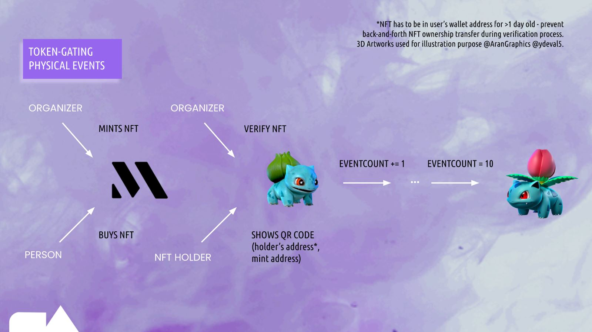
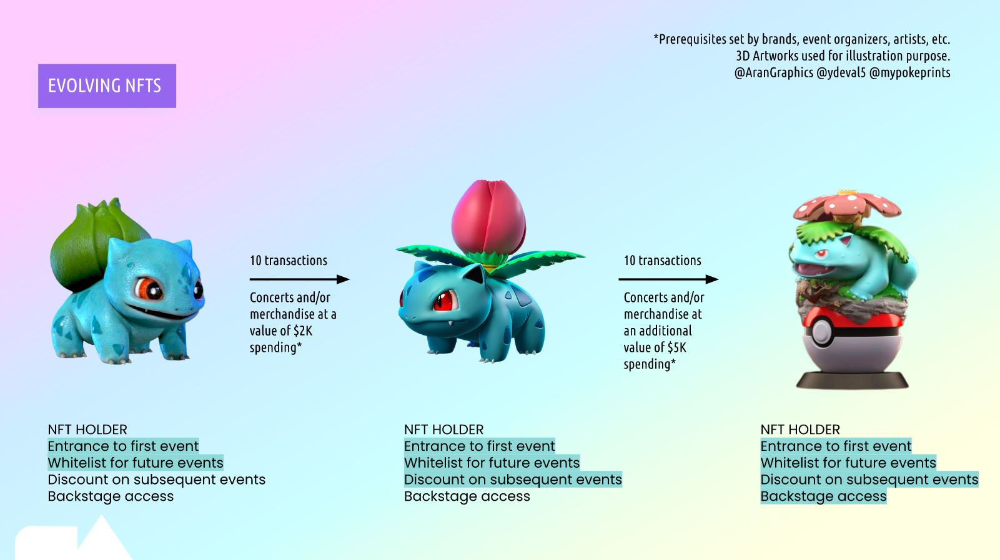
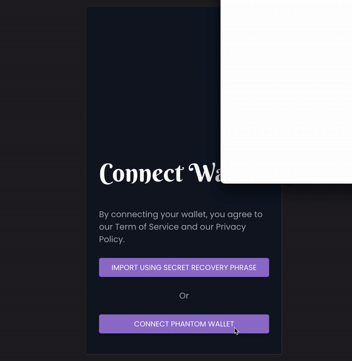
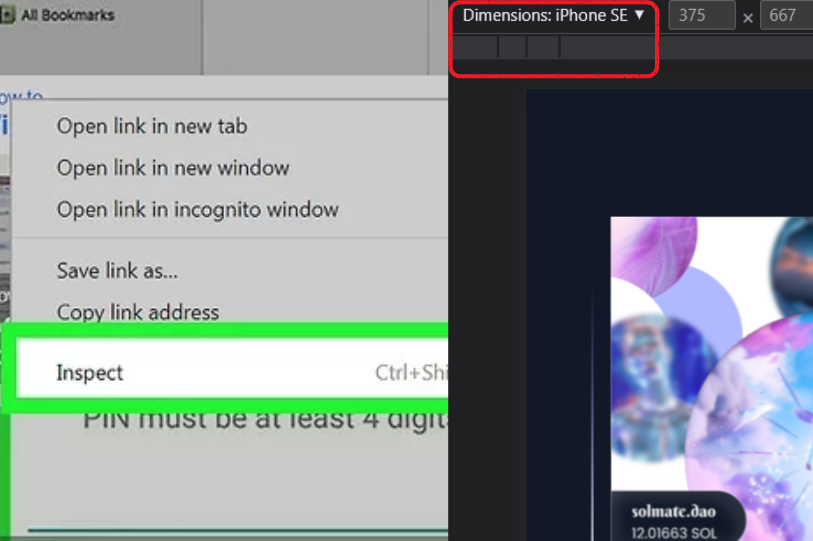

# SolMate

Our project marries Token Gating with the concept of evolving NFTs to foster brand loyalty.

For a better understanding of the project, do check out our pitch deck [here](https://docs.google.com/presentation/d/e/2PACX-1vT4bMDMy_1NUigecJNweBh_VUWENRs-ixwJpuVP_o5N5nndn-Aw8xL8bRgBNq5Rg_v7_OT-0aAOxkKM/pub?start=false&loop=false&delayms=60000&slide=id.p) and the demo of our application [here](https://drive.google.com/file/d/1tviIHyfpaoS_IGoR_AY8kJnKF4U5xU1Y/view?usp=sharing)!

<p align='center'>

</p>

# Table of Contents
- [About](#about)
- [Walkthrough](#walkthrough)
- [Technical Overview](#technical-overview)
- [Using Solmate](#using-solmate)
- [BUILDERS](#builders)

# About
As it stands, current Token Gating solutions only serve as one off passes to events and gated digital content, essentially behaving as repurposed physical tickets. How can we leverage on the underlying technology behind NFTs to turn them into loyalty cards which can help brands build stronger connections with their community as well as reward users for their commmitment and loyalty?

Our solution Solmate aims to bridge Token Gating with the concept of Evolving NFTs to do just that. A user would buy an NFT and use it to become verified for an event as he would in typical Token Gating. However, an evenCount would be tied to the NFT as well, which increments with every event that the user goes for. After hitting a certain count, the NFT would evolve into a different tier (this is achieved through the mutation of the NFT's uri). The evolved NFT would entitle the user to new benefits / rewards like free merchandising and access to unique gated content. 

We believe that this concept would help to make NFT ownership and Token Gating a more interactive experience which will further encourage users to support their favourite brands, and onboard more people into Web 3.0!

For a deeper breakdown of our solution, please refer to our pitch deck!

<p align='center'>

</p>

# Walkthrough
Our web app demonstrates the typical user flow as a proof of concept. The user flow is as follows:

1. The user is introduced to the app in our getting started screens
2. The user connects his/her wallet
3. Users are introduced to existing NFTs in their wallet
4. On clicking the QR Code icon at the top right, users are routed to the screen containing a QR Code associated with their wallet
5. On verification of this QR Code, a signal is given to both the user and the verifier that the user indeed has the NFT ticket and would be allowed into the venue
6. Behind the scenes, the NFT's counter increases and evolves when the condition stipulated by the organiser is met

The end product is a token gating solution with NFTs that induces customer loyalty through inherent rewards by participating in more events. Below is a walkthrough video of our application!

<p align='center'>

</p>

# Technical Overview
<p align='center'>

</p>

# Using Solmate
when first trying out our application you would first need to download the necessary packages and enter the subdirectory 'frontend' before running npm start as seen below
````
cd .\frontend\
npm start
````

If you happen to encounter the error as seen below, change the name of '.\src\pages\Nftprofile.jsx'. to '.\src\pages\Nft<b>P</b>rofile.jsx'. with a capital P
````
Cannot find file: 'NftProfile.jsx' does not match the corresponding name on disk: '.\src\pages\Nftprofile.jsx'.
````

Since our application is optimized for iphone SE, when running the application, you would need to first right click on your browser and press inspect. Then at the top of the browser, change the device to iphone SE as seen in the image below
<p align='center'>

</p>

Alternatively you can also check out our application which is deployed [here](https://solmate.netlify.app/), however you would need to follow the inspect optimization as mentioned in the previous paragraph!

# BUILDERS
Brought together through fate at one of Solana Summer Camp 2022's workshops, we are a team of young builders and strategists hacking away at a key we believe brands, event organizers, developers, and artists can utilize to engage their community with.

Do feel free to connect with us!
- Liam Ayathan [[LinkedIn]](https://www.linkedin.com/in/liam-ayathan-046b3816b/) , [[Github]](https://github.com/liam-ayathan)
- Maaruni Pandithurai [[LinkedIn]](https://www.linkedin.com/in/maaruni/), [[Github]](https://github.com/maars202)
- George Loh [[LinkedIn]](https://www.linkedin.com/in/ying-zhe-george-loh-17756a95/) , [[Github]](https://github.com/YZLoh)
- Rui Xin Oh [[LinkedIn]](https://www.linkedin.com/in/ruixinoh/) , [[Github]](https://github.com/nraven721)
- Yun Waddy Soe [[LinkedIn]](https://www.linkedin.com/in/yunwaddysoe/) , [[Github]](https://github.com/yunsoe)
- Loh Kok Wee [[LinkedIn]](https://www.linkedin.com/in/loh-kok-wee-59a698142/) , [[Github]](https://github.com/lohkokwee)

[Back to top](#table-of-contents)


